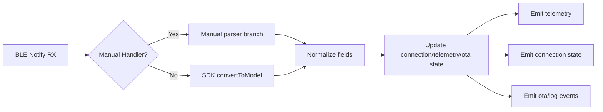

# Runtime Flow Diagrams

```mermaid
flowchart LR
  A[Flutter Action] --> B[MethodChannel Envelope]
  B --> C[Native Bridge Dispatcher]
  C --> D[Native BLE/SDK Command]
  D --> E[Scooter]
  E --> F[Notify Callback]
  F --> G[Parser]
  G --> H[Native State Update]
  H --> I[EventChannel Emission]
  I --> J[Flutter State Reducer]
```

```mermaid
flowchart LR
  A[BLE Notify RX] --> B{Manual Handler?}
  B -->|Yes| C[Manual parser branch]
  B -->|No| D[SDK convertToModel]
  C --> E[Normalize fields]
  D --> E
  E --> F[Update connection/telemetry/ota state]
  F --> G[Emit telemetry]
  F --> H[Emit connection state]
  F --> I[Emit ota/log events]
```
