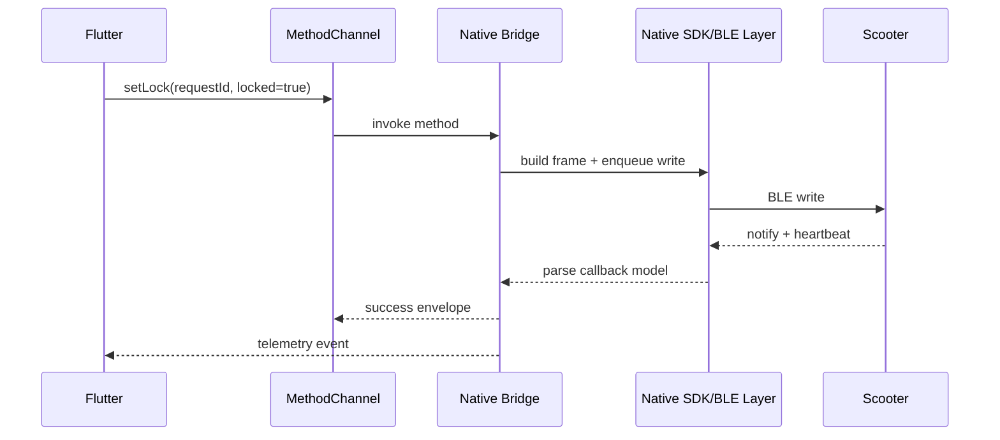
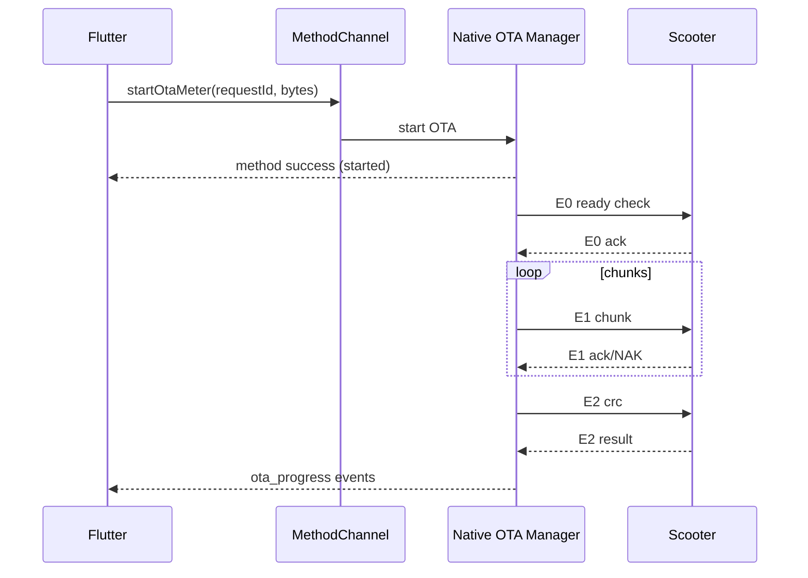

# Sequence Diagrams

```mermaid
sequenceDiagram
  participant F as Flutter
  participant MC as MethodChannel
  participant N as Native Bridge
  participant S as Native SDK/BLE Layer
  participant D as Scooter
  F->>MC: setLock(requestId, locked=true)
  MC->>N: invoke method
  N->>S: build frame + enqueue write
  S->>D: BLE write
  D-->>S: notify + heartbeat
  S-->>N: parse callback model
  N-->>MC: success envelope
  N-->>F: telemetry event
```

```mermaid
sequenceDiagram
  participant F as Flutter
  participant MC as MethodChannel
  participant N as Native OTA Manager
  participant D as Scooter
  F->>MC: startOtaMeter(requestId, bytes)
  MC->>N: start OTA
  N-->>F: method success (started)
  N->>D: E0 ready check
  D-->>N: E0 ack
  loop chunks
    N->>D: E1 chunk
    D-->>N: E1 ack/NAK
  end
  N->>D: E2 crc
  D-->>N: E2 result
  N-->>F: ota_progress events
```
